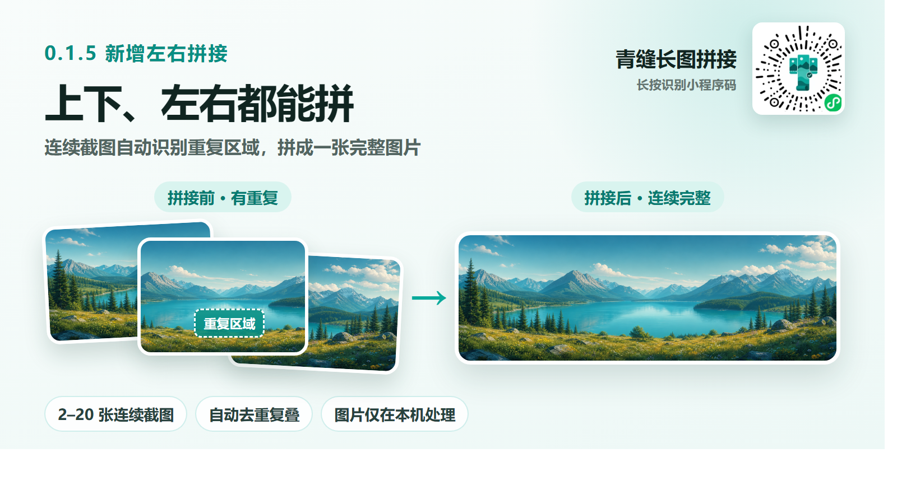

# 青缝长图拼接

一款原生微信小程序：按顺序选择 2–20 张连续截图，在手机本地识别重复区域、微调接缝，并导出 PNG 长图或宽图。



## 核心能力

- 支持上下拼接和左右拼接，分别适配竖向截图与横向截图。
- 自动识别相邻截图的重复区域，并处理固定顶部栏和底部栏。
- 低置信度、低纹理或无可靠重叠时进入手动接缝，不静默猜测。
- 支持图片排序、任务取消、拼接预览、PNG 导出和保存相册。
- 最终结果限制为 1600 万像素，且任一边不超过 32767 px；超出时自动等比缩小。
- 支持固定首页卡片转发给好友或朋友圈，卡片不包含用户原图或拼接结果。

## 隐私设计

- 原图和拼接结果只在当前设备处理，不上传服务器。
- 不创建账号，不使用数据库、分析 SDK、第三方 SDK 或外部网页。
- 不包含用户内容发布、社区、评论或公开展示功能。
- `project.private.config.json`、依赖目录、日志和本地工具目录均已加入 Git 忽略规则。

## 技术架构

| 模块 | 说明 |
| --- | --- |
| `miniprogram/pages/index` | 单页状态机、选图、方向切换、接缝微调与结果交互 |
| `miniprogram/workers` | 可独立测试的重叠识别算法与 Worker 协议 |
| `miniprogram/services/stitch-plan.ts` | 上下/左右裁切计划与输出尺寸控制 |
| `miniprogram/services/canvas.ts` | Canvas 2D 渲染、预览与 PNG 导出 |
| `miniprogram/lib/source-validation.js` | 输入图片尺寸与方向校验 |
| `tests` | Node 内置测试覆盖算法、隐私流程、分享和任务取消 |

主要技术：TypeScript、WXML、WXSS、Canvas 2D、Worker、Node.js Test Runner。

## 本地运行

### 环境要求

- Node.js 20 或更高版本
- 微信开发者工具
- 微信小程序测试号或自己的 AppID

### 步骤

```bash
git clone https://github.com/a764119732/seamless-long-image-miniapp.git
cd seamless-long-image-miniapp
npm ci
npm run check
```

随后使用微信开发者工具导入项目根目录。项目的小程序目录为 `miniprogram/`，基础库版本为 2.32.3。

贡献者应在自己的本地私有配置中使用测试号或个人 AppID，不要提交 App Secret、上传私钥、Token、Cookie 或 `project.private.config.json`。

## 可用命令

```bash
npm run typecheck  # TypeScript 类型检查
npm test           # 运行自动测试
npm run check      # 类型检查 + 全部测试
```

## 当前边界

- 输入图片应来自同一设备、方向一致，并具有相同的尺寸基准。
- 上下拼接要求竖向截图，左右拼接要求横向截图。
- 明显错位、缩放变化、透视变化和跨设备截图不保证自动匹配。
- 本项目不提供云端历史记录、跨设备同步或用户内容托管。

## 项目状态

- 当前源码版本：`0.1.5`
- 当前维护状态：持续维护
- 版本记录：[CHANGELOG.md](CHANGELOG.md)
- 参与贡献：[CONTRIBUTING.md](CONTRIBUTING.md)
- 安全问题：[SECURITY.md](SECURITY.md)

## 项目文档

- 产品与视觉规范：[docs/design-system.md](docs/design-system.md)
- 0.1.5 审核说明：[docs/release/0.1.5-审核说明.md](docs/release/0.1.5-审核说明.md)
- 0.1.4 审核申诉记录：[docs/审核申诉-0.1.4.md](docs/审核申诉-0.1.4.md)
- 小程序增长研究（2026-07-29）：[docs/research/wechat-miniapp-growth-2026-07-29.md](docs/research/wechat-miniapp-growth-2026-07-29.md)
- 多平台转化素材包：[docs/marketing/跨平台转化素材包-2026-07-29.md](docs/marketing/跨平台转化素材包-2026-07-29.md)

带日期的审核、研究和营销文档用于保留项目决策依据，其内容反映对应日期的状态，不代表微信平台规则或线上版本的实时状态。

## 许可证

本项目采用 [MIT License](LICENSE) 开源。
